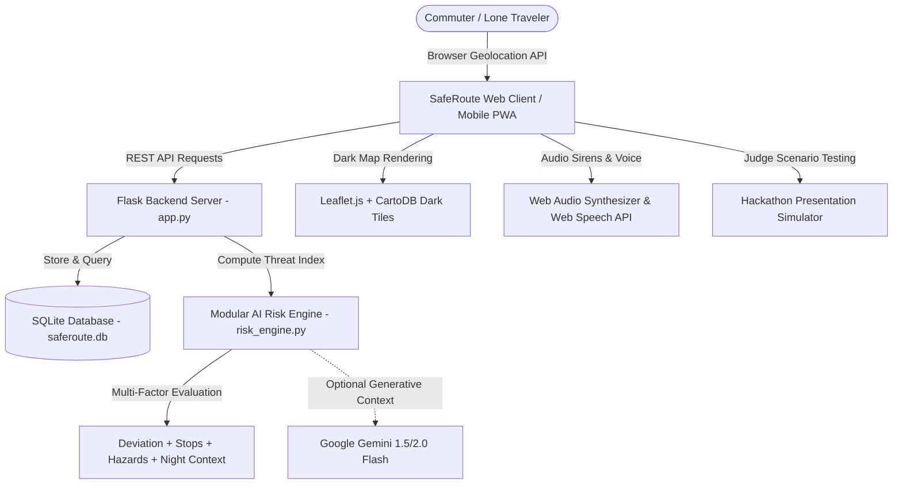

<div align="center">

# 🛡️ SafeRoute AI
### **AI-Powered Personal Safety Companion**
*Built for the Hack2Skill **"SafetyNet"** Hackathon*

[](https://python.org)
[](https://flask.palletsprojects.com/)
[](https://sqlite.org)
[](https://leafletjs.com)
[](https://tailwindcss.com)
[](LICENSE)

<p align="center">
  <b>DETECT</b> &nbsp;→&nbsp; <b>ASSESS</b> &nbsp;→&nbsp; <b>EXPLAIN</b> &nbsp;→&nbsp; <b>ASSIST</b> &nbsp;→&nbsp; <b>ESCALATE</b>
</p>

</div>

---

## 📖 Executive Summary & Problem Statement

Millions of lone travelers, university students, and late-night commuters experience anxiety and vulnerability while navigating urban corridors after dark. Traditional safety apps are often reactive—only offering a panic button after an incident has already unfolded.

**SafeRoute AI** introduces a **proactive, intelligent safety loop**:
1. **DETECT**: Monitors real-time transit telemetry (route deviation, stationary wait times, battery health, time-of-night context, crowdsourced safety hazards).
2. **ASSESS**: Computes a transparent, mathematical Risk Threat Index ($0 - 100$) mapped to **SAFE**, **CAUTION**, and **HIGH RISK**.
3. **EXPLAIN**: Communicates clearly in natural language *why* the threat index changed (e.g. *"Risk increased because you deviated 110m into an unverified corridor near a reported hazard zone"*).
4. **ASSIST**: Recommends micro-actions with 1-click execution (re-centering onto planned path, navigating to nearest 24/7 Safe Haven, or performing safety check-ins).
5. **ESCALATE**: Provides automated grace-period check-in countdowns and an Emergency SOS console with instant WhatsApp & SMS dispatch links to trusted contacts.

---

## 🏗️ Architecture & Component Flow



---

## ✨ Key Features

- **🧠 Transparent AI Risk Assessment Engine**:
  - Itemized contributing factors with numerical delta points (`+28 Off-Route`, `+26 Long Stop`, `+16 Night`, `+22 Harassment Hotspot`).
  - Compound risk synergy multiplier when multiple concurrent threats coincide.
  - Zero black-box fluff: Every point corresponds to verifiable sensor and environmental data.

- **🗺️ Interactive Cyber-Safety Cartography**:
  - Live animated radar beacon tracking user GPS.
  - Planned safety corridor (cyan dashed glow) vs. actual walked path (dynamic threat-colored glow).
  - 24/7 Verified Safe Havens (Campus security booths, 24-hr pharmacies, transit police kiosks).
  - Hazard zones with clickable pins and community confirmation upvotes.

- **⏱️ Automated Safety Check-in Mechanism**:
  - Interval countdown with radial & linear progress indicators.
  - 1-Tap "I'm Safe" heartbeat acknowledgment.
  - 30-second warning grace period with audible alerts before escalating.

- **🚨 Emergency SOS Console & Network Broadcast**:
  - Full-screen emergency lockdown view with pulsing red strobe animations.
  - Web Audio API dual-frequency oscillating emergency siren synthesizer.
  - GPS coordinate capture + Google Maps link generation.
  - 1-Click WhatsApp and SMS pre-formatted emergency dispatch links for trusted contacts.
  - PIN-secured disarm mechanism (Default PIN: `1234`).

- **👥 Trusted Contacts & Demo Profile**:
  - Complete CRUD management for trusted emergency contacts.
  - Preferences for SMS & WhatsApp automatic notifications.

- **⚠️ Community Safety Hazard Board (Stretch Goal)**:
  - Crowdsourced reports for poor lighting, harassment hotspots, isolated alleys, and suspicious activity.
  - Direct integration into proximity risk calculations.

- **🎮 Dedicated Hackathon Judge / Presentation Simulator**:
  - 1-Click Presentation Stories (*Safe Walk* $\to$ *Route Deviation* $\to$ *Night Stop* $\to$ *Missed Check-in* $\to$ *Full SOS*).
  - Granular interactive sliders to test the live risk engine in real time.
  - 1-Click Reset Demo button to restore a clean baseline.

---

## 📂 Project Directory Structure

```
saferoute-ai/
├── app.py                     # Flask backend server, REST API endpoints, static routing
├── models.py                  # SQLAlchemy data models (Profile, Contact, Journey, Report, RiskLog)
├── risk_engine.py             # Modular AI Risk Assessment & Explainability Engine
├── seed_data.py               # Pre-populated demo presets, safe havens, reports, and contacts
├── test_app.py                # Automated unit test suite (9/9 passing tests)
├── verify_live.py             # Live HTTP server verification & asset check suite
├── requirements.txt           # Python dependencies
├── .gitignore                 # Excludes databases, bytecode, cache, and secrets
├── .env.example               # Environment variables configuration template
├── LICENSE                    # MIT License
├── static/
│   ├── css/
│   │   └── styles.css         # Cyber-safety dark theme, glassmorphism, radar pulse, strobe
│   └── js/
│       ├── api.js             # REST API client
│       ├── app.js             # Single-Page Application coordinator & tab router
│       ├── checkin.js         # Check-in countdown timer, grace period, and audio alerts
│       ├── demo.js            # Judge presentation simulator & scenario runner
│       ├── map.js             # Leaflet map manager, polylines, hazard circles, beacons
│       ├── risk_gauge.js      # Animated SVG radial gauge, factor chips, and sparkline
│       ├── sos.js             # Emergency SOS overlay, siren audio, and WhatsApp/SMS links
│       └── voice.js           # Web Speech API voice companion & Web Audio synthesizer
└── templates/
    └── index.html             # Responsive dashboard (Desktop & Mobile optimized)
```

---

## 🚀 Getting Started

### Prerequisites
- Python 3.10 or higher (Python 3.14 recommended)
- A modern web browser (Chrome, Edge, Firefox, Safari)

### Installation & Run

1. **Clone the repository:**
   ```bash
   git clone https://github.com/your-username/saferoute-ai.git
   cd saferoute-ai
   ```

2. **Install dependencies:**
   ```bash
   pip install -r requirements.txt
   ```

3. **(Optional) Configure environment variables:**
   ```bash
   cp .env.example .env
   ```
   *Note: If `GEMINI_API_KEY` is omitted, SafeRoute AI automatically operates in 100% deterministic local mode with zero external dependencies.*

4. **Launch the application:**
   ```bash
   python app.py
   ```

5. **Open in your browser:**
   ```
   http://127.0.0.1:5000
   ```

---

## 🧪 Testing & Validation

### Automated Unit Tests
Run the comprehensive test suite covering the AI Risk Engine, REST APIs, journey lifecycle, and emergency protocols:
```bash
python -m unittest test_app.py
```
*Output: `Ran 9 tests in 0.593s -> OK`*

### Live Integration Suite
Verify all 9 static assets, live database transactions, and end-to-end endpoints on a running server:
```bash
python verify_live.py
```
*Output: `ALL LIVE SERVER SUITE TESTS PASSED WITH 100% SUCCESS!`*

---

## 🏆 2-Minute Hackathon Demo Script for Judges

| Step | Action | What to Highlight |
|---|---|---|
| **1. Overview** | Open `http://127.0.0.1:5000` | Point out the cyber-safety dashboard, live GPS lock indicator, and user profile. |
| **2. Start Journey** | Click **"Start Safe Journey"** $\to$ Select *North Campus Dormitory* | Cyan planned route appears on Leaflet map; initial threat score is **SAFE (12)**. |
| **3. Open Simulator** | Click **"Judge Simulator"** at top right | Emphasize that the simulator connects to the **real mathematical risk engine**. |
| **4. Story 1: Off-Route** | Click **"2. Off-Route (48)"** | Threat index increases to **CAUTION (48)**; AI explains the 110m deviation; voice companion provides tactical guidance. |
| **5. Story 2: Night Stop** | Click **"3. Night Stop (64)"** | Shows compound risk: stationary wait time + late-night modifier. |
| **6. Story 3: High Risk** | Click **"4. High Risk (84)"** | Missed check-in + proximity to harassment hotspot triggers **HIGH RISK (84)** and voice warning. |
| **7. Emergency SOS** | Click **"EMERGENCY SOS"** | Full-screen lockdown view transforms UI; audible siren sounds; live GPS coordinates & 1-click WhatsApp/SMS links appear. |
| **8. Disarm & Reset** | Click **"Enter PIN to Disarm"** $\to$ Enter `1234` $\to$ Click **"Reset Demo"** | Restores pristine baseline. |

---

## 📡 REST API Reference

| Method | Endpoint | Description |
|---|---|---|
| `GET` | `/api/config` | Returns app configuration, preset routes, and safe havens |
| `GET` | `/api/profile` | Fetches active user profile and trusted contacts |
| `PUT` | `/api/profile` | Updates user settings, PIN, or battery status |
| `POST` | `/api/contacts` | Adds a new trusted emergency contact |
| `DELETE` | `/api/contacts/<id>` | Removes a trusted contact |
| `GET` | `/api/journey/active` | Retrieves active journey state & recent risk logs |
| `POST` | `/api/journey/start` | Initiates a new monitored transit journey |
| `POST` | `/api/journey/update-location` | Updates live coordinates, evaluates risk engine, appends actual path |
| `POST` | `/api/journey/checkin` | Acknowledges "I'm Safe" check-in heartbeat |
| `POST` | `/api/journey/missed-checkin` | Increments missed check-in counter and triggers escalation |
| `POST` | `/api/journey/end` | Concludes active journey |
| `POST` | `/api/sos` | Activates Emergency SOS, logs event, and creates dispatch payloads |
| `POST` | `/api/sos/resolve` | Resolves SOS state via safety PIN |
| `GET` | `/api/reports` | Lists community safety hazard reports |
| `POST` | `/api/reports` | Submits a new crowdsourced hazard report |
| `POST` | `/api/reports/<id>/upvote` | Confirms/upvotes a safety report |
| `POST` | `/api/risk/evaluate` | Direct evaluation endpoint for simulator and headless clients |
| `POST` | `/api/demo/reset` | Resets database and journey states to clean baseline |

---

## 📄 License

This project is licensed under the MIT License - see the [LICENSE](LICENSE) file for details.
